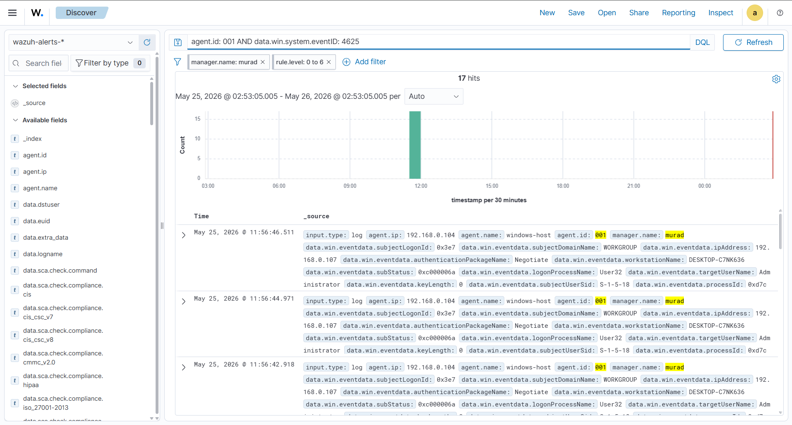
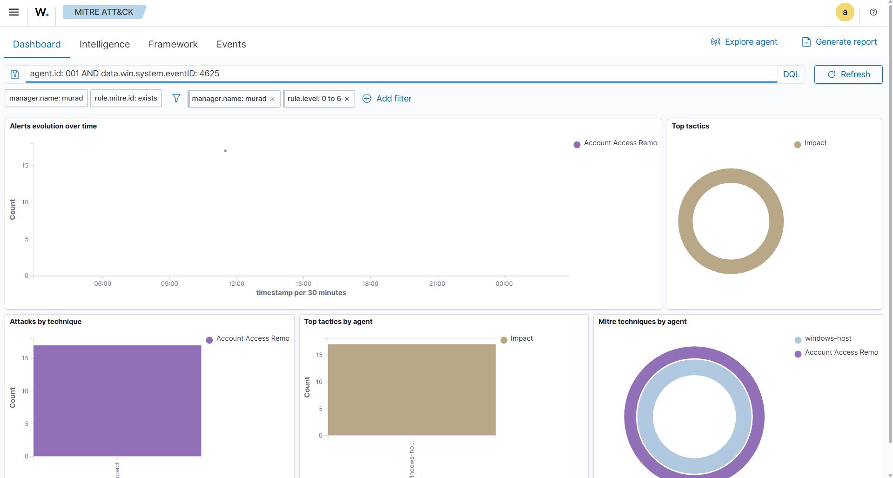
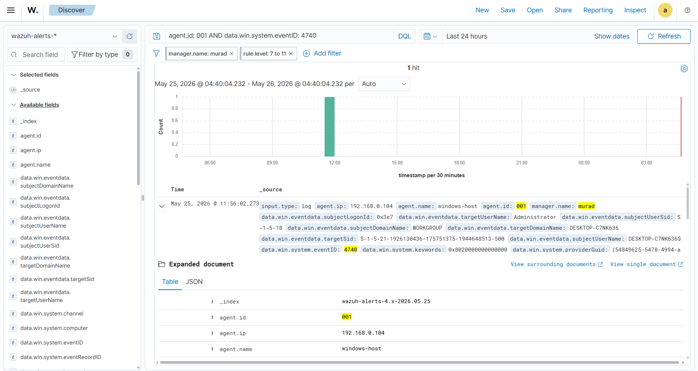

<div align="center">

# 🔴 Lab 01 — RDP Brute Force Detection


*Simulating an RDP brute force attack from Kali Linux against a Windows 11 host and detecting it with Wazuh SIEM.*

</div>

---

## 🗺️ Environment

| Machine | Role | OS | IP |
|--------|------|----|----|
| Kali Linux | Attacker | Kali Linux | 192.168.0.107 |
| Windows 11 | Target + Wazuh Agent | Windows 11 Pro | 192.168.0.104 |
| Ubuntu Server | Wazuh Manager | Ubuntu 22.04 | 192.168.0.106 |

---

## 🎯 Objective

Simulate an RDP brute force attack and validate that Wazuh correctly detects, classifies, and maps the activity to MITRE ATT&CK — covering failed logins, account lockout, and administrative responses.

---

## 🛠️ Tools Used

| Tool | Purpose |
|------|---------|
| Wazuh 4.12 | SIEM — alert generation and correlation |
| OpenSearch Dashboards | Alert visualization and DQL queries |
| xfreerdp | RDP client used to generate failed login attempts |
| Crowbar 0.4.2 | RDP brute force tool |
| Windows Event Viewer | Verifying Event ID generation on target |
| PowerShell | Registry configuration on Windows target |

---

## ⚙️ Pre-Attack Setup

### 1. Windows Target Configuration

RDP must be enabled and NLA disabled before the attack can generate detectable events.

> **Why disable NLA?**
> NLA (Network Level Authentication) requires credentials *before* establishing an RDP session. Brute force tools send credentials *after* connecting — so with NLA active, the connection is rejected before Windows logs any failure event. No log = nothing for Wazuh to detect.
>
> Additionally, disabling NLA from System Properties UI is **not enough** — it changes only one of three registry keys. All three must be set.

```powershell
# Enable RDP
Set-ItemProperty -Path 'HKLM:\System\CurrentControlSet\Control\Terminal Server' `
  -Name "fDenyTSConnections" -Value 0

# Disable NLA at registry level (3 keys required)
Set-ItemProperty -Path 'HKLM:\System\CurrentControlSet\Control\Terminal Server\WinStations\RDP-Tcp' `
  -Name "SecurityLayer" -Value 0
Set-ItemProperty -Path 'HKLM:\System\CurrentControlSet\Control\Terminal Server\WinStations\RDP-Tcp' `
  -Name "UserAuthentication" -Value 0

# Restart RDP service to apply changes
Restart-Service -Name "TermService" -Force

# Add Administrator to Remote Desktop Users group
net localgroup "Remote Desktop Users" Administrator /add

# Enable Administrator account
net user Administrator /active:yes
```

### 2. Audit Policy Verification

Without this, Windows never writes Event ID 4625 to the Security log — Wazuh has nothing to detect.

```cmd
auditpol /get /subcategory:"Logon"
```

| Category | Setting |
|----------|---------|
| Logon/Logoff > Logon | **Success and Failure** ✅ |

### 3. Wazuh Agent — Connectivity Check

```
Agent log: C:\Program Files (x86)\ossec-agent\ossec.log
Expected:  INFO: Agent is now online. Process unlocked, continuing...
```

> **Critical:** If the agent cannot reach the manager on port 1514, events are queued locally and eventually dropped. The dashboard shows nothing — no error, no alert. Always verify connectivity before running detection tests.

---

##💥 Attack Execution
Step 1 — Manual verification with xfreerdp
Before running the full attack, single failed login attempts were made manually to confirm RDP was reachable and events were being generated.
```bash 
xfreerdp /v:192.168.0.104 /u:Administrator /p:wrongpassword /cert:ignore
```
Step 2 — Brute force with Crowbar
# Run brute force — this triggered account lockout
```bash
crowbar -b rdp -s 192.168.0.104/32 -u Administrator -C /tmp/rockyou.txt -n 1 -v
```
Crowbar's repeated attempts hit the account lockout threshold, locking out the Administrator account and generating Event ID 4740.---

## 📊 Attack Timeline

```
[T+00s]  Crowbar starts — RDP login attempts begin
[T+10s]  Windows logs Event ID 4625 (Logon Failure) repeatedly
[T+45s]  Account lockout threshold reached
[T+46s]  Windows logs Event ID 4740 (Account Locked Out)
[T+47s]  Wazuh Agent captures all events → forwards to Manager (port 1514)
[T+48s]  Wazuh fires Rule 60115 (Level 9) — HIGH severity alert
[T+49s]  Alert visible in OpenSearch Dashboard
```

---

## 🚨 Alerts Detected

| Rule ID | Event ID | Level | Description | MITRE ID | Tactic |
|---------|----------|-------|-------------|----------|--------|
| 60122 | 4625 | 5 | Logon Failure — Unknown user or bad password | T1110 | Credential Access |
| 60115 | 4740 | 9 | User account locked out (multiple login errors) | T1110 | Credential Access |
| 60109 | 4722 | 8 | User account enabled | T1098 | Persistence |
| 60110 | 4738 | 8 | User account changed | T1098 | Persistence |

> **Note:** Alerts 60109 and 60110 were triggered by unlocking the Administrator account after lockout. This shows Wazuh monitors both attack activity and administrative responses — in a real SOC, these would require analyst context to distinguish attacker from defender actions.

---

## 🔍 DQL Queries

| Query | Purpose |
|-------|---------|
| `agent.id: 001 AND data.win.system.eventID: 4625` | All failed RDP logins |
| `agent.id: 001 AND data.win.system.eventID: 4740` | Account lockout events |
| `agent.id: 001 AND rule.groups: authentication_failed` | All authentication failures |
| `agent.id: 001 AND rule.id: 60115` | Lockout alerts only |

---

## 📸 Screenshots

### Wazuh Discover — Event ID 4625 Detected


### MITRE ATT&CK Dashboard


### Account Lockout Alert — Event ID 4740


### Alert JSON — Rule 60122


---

## 🧩 Troubleshooting Encountered

| Problem | Root Cause | Fix |
|---------|-----------|-----|
| Hydra RDP module failing | Hydra RDP module is experimental | Switched to Crowbar + xfreerdp |
| NLA still active after UI change | System Properties only changes `UserAuthentication` key | Changed all 3 registry keys via PowerShell |
| `account not active for remote desktop` | Administrator not in RDP Users group | `net localgroup "Remote Desktop Users" Administrator /add` |
| No alerts in Wazuh | Agent offline — port 1514 refused | Agent reconnected automatically; verified via ossec.log |
| 4625 events in Event Viewer but not Wazuh | Agent was offline during attack window | Re-ran attack after agent came online |

---

## 🧠 Lessons Learned

**NLA is more complex than it looks.**
The System Properties UI only controls one registry key. Full NLA enforcement is spread across three separate registry values — disabling all three is required for brute force tools to reach the authentication stage and generate 4625 events.

**Agent connectivity is a silent failure.**
A disconnected Wazuh agent produces no warning in the dashboard. Events are generated on the Windows side, logged in Event Viewer, but never reach the manager. Always verify agent status with `ossec.log` before running detection tests.

**Account lockout is both a defense and a signal.**
The lockout policy stopped the brute force — but it also generated a high-severity alert (Level 9, Rule 60115). In a real SOC, this would be the most actionable event in the chain: confirmed brute force, confirmed attacker IP, confirmed target account.

**Defensive actions generate their own alerts.**
Unlocking and re-enabling the Administrator account triggered MITRE T1098 (Account Manipulation) alerts. SOC analysts must understand the full incident context before triaging — the same event can mean attack or response depending on who performed it.

**Audit Policy is foundational.**
Without Logon Failure auditing enabled, Windows never writes the 4625 event. The entire detection chain breaks silently at the source.

---

<div align="center">
<sub>← <a href="../../README.md">Back to main lab index</a></sub>
</div>
